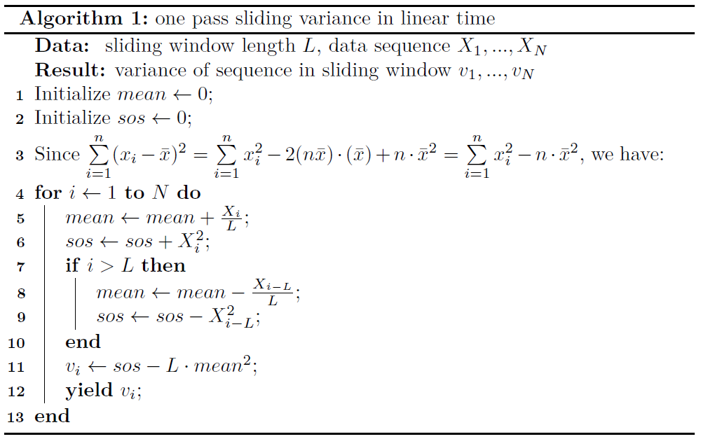

滑窗计算方差
============

1. 算法场景
-----------

给定一个时间序列 :math:`X(t)=\{x_1,x_2,...,x_i,...\}`，时刻 :math:`t_i` 对应的值为 :math:`x_i`，
我们需要以窗长为 :math:`n`、步长为 1 进行滑窗计算该窗内时间序列的方差，也就是在每个时刻 :math:`t_i` 输出最近 :math:`n` 个值的方差，
并且尽量减少线程阻塞的可能。

2. 问题分析
-----------

我们先从一个简单情况入手，对于一个时间序列 :math:`\{x_1,x_2,...,x_n\}` ，求这 :math:`n` 个值的方差。
根据\ `方差`_\ 公式：

.. math::

    Var(X) = \frac{1}{n}\sum\limits_{i=1}^n (x_i-\bar{x})^2

在时间点\ :math:`t_n`\ 处使用该公式即可。
在每个时间点上平均计算次数如下：

.. csv-table:: 常规方法求时间序列方差时间分析
    :align: center
    :widths: auto
    :header: ,t\ :sub:`1`,t\ :sub:`2`,...,t\ :sub:`n-1`,t\ :sub:`n`

    平均操作次数,0,0,...,0,O(n)
    状态,idle,idle,...,idle,busy

可见整个计算过程主要的时间花费在最后一帧，当 :math:`n` 比较大时，容易造成线程阻塞。
如果我们能将公式进行拆分重组，将计算过程分摊给每一帧，则会降低线程阻塞的风险。
事实上，我们有：

.. math::

     Var(X) &= \frac{1}{n}\sum\limits_{i=1}^n (x_i-\bar{x})^2 \\
            &= \frac{1}{n}\sum\limits_{i=1}^n (x_i^2-2\cdot x_i\cdot\bar{x}+\bar{x}^2) \\
            &= \frac{1}{n}\sum\limits_{i=1}^n x_i^2 - 2\cdot\bar{x}\cdot(\frac{1}{n}\sum\limits_{i=1}^n x_i) + \frac{1}{n}\sum\limits_{i=1}^n \bar{x}^2 \\
            &= \frac{1}{n}\sum\limits_{i=1}^n x_i^2 - 2\cdot\bar{x}\cdot\bar{x} + \bar{x}\cdot\bar{x} \\
            &= \frac{1}{n}\sum\limits_{i=1}^n x_i^2 - \bar{x}^2

于是，方差的计算可以按时间进行分配，每一帧仅更新 :math:`\sum\limits_{i=1}^n x_i^2` 和 :math:`\bar{x}` 即可。
分别用 :math:`S` 和 :math:`s` 更新两者，具体如下：

.. csv-table::
    :align: center
    :widths: auto
    :header: ,t\ :sub:`1`,t\ :sub:`2`,...,t\ :sub:`n-1`,t\ :sub:`n`

    :math:`s=0`,:math:`s=s+x_1`,:math:`s=s+x_2`,...,:math:`s=s+x_{n-1}`,:math:`s=s+x_n`
    :math:`S=0`,:math:`S=S+x_1^2`,:math:`S=S+x_2^2`,...,:math:`S=S+x_{n-1}^2`,:math:`S=S+x_n^2`
    平均操作次数,O(1),O(1),...,O(1),O(1)

最终所求方差则为

.. math::
    Var(X) = \frac{1}{n}\cdot (S-s^2)

回到原问题，当我们需要滑窗求时间序列的方差时，也只需要不断更新 :math:`S` 和 :math:`s` 即可，
每一帧更新只需要O(1)的时间复杂度，和O(1)的空间复杂度。

3. 算法复杂度
-------------

Time Complexity per frame on average: **O(1)**

Space Complexity per frame on average: **O(1)**

4. 代码
-------

``python``

.. code-block:: python
    :linenos:

    def calc_sliding_var(x: list, k: int):
        S = s = 0
        n = len(x)
        for i in range(n):
            s += x[i]
            S += x[i] ** 2
            if i >= k:
                s -= x[i-k]
                S -= x[i-k]**2
                yield (S - s**2) / n

5. 附录
-------

   滑窗计算方差伪代码

.. _`方差`: https://en.wikipedia.org/wiki/Variance
